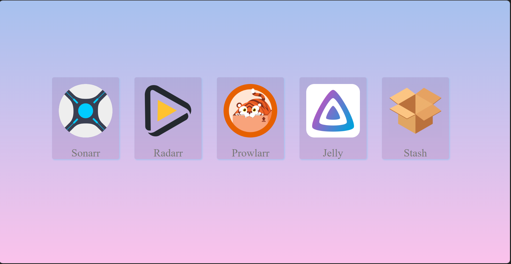

## Localhost Manager


Localhost Manager is a collection of services that can be used to manage media files on your local machine. The following services are included:

- **Sonaar**: A TV show management tool.
- **Radaar**: A movie management tool.
- **Prowlaar**: A music management tool.
- **Jelly**: A media server that streams movies, TV shows and music to clients.
- **Stash**: A password manager tool.


## Installation

To use Localhost Manager, you must have Docker installed on your machine. Follow the instructions below to install Docker.

### Installing Docker

Docker provides installation instructions for various platforms on its website. Follow the instructions for your platform below:

- **Windows**: https://docs.docker.com/docker-for-windows/install/
- **macOS**: https://docs.docker.com/docker-for-mac/install/
- **Linux**: https://docs.docker.com/engine/install/

### Running Localhost Manager

To run Localhost Manager, you can use `docker-compose`. Follow the steps below to get started:

1. Clone the `localhost-manager` repository from GitHub: 

    git clone https://github.com/<your-username>/localhost-manager.git


2. Navigate to the `localhost-manager` directory: 


3. Run the following command to start all the services: 

    `docker-compose up -d`


This will start all the services in the background.

4. To access each service, open a web browser and navigate to the URLs listed below:

- Sonaar: http://localhost:8989/
- Radaar: http://localhost:7878/
- Prowlaar: http://localhost:9696/
- Jelly: http://localhost:8096/
- Stash: http://localhost:9999/

Each service can be accessed using the listed URL and the port number.

5. To stop the services, run the following command:


This will stop all the services and remove the containers.

    docker-compose down

## Adding your own Localhost

To add your own Localhost to the Localhost Manager, you will need to edit the `config.yaml` file. Follow the steps below to add your Localhost:

1. Navigate to the `localhost-manager` directory.
2. Open the `config.yaml` file in a text editor.
3. Add a new item to the list under the `SITES` section, with the following details:


```
NAME: <name of your Localhost>
port: <port number of your Localhost>
cover: <image file name for your Localhost>
```


Replace `<name of your Localhost>` with the name of your Localhost, `<port number of your Localhost>` with the port number of your Localhost, and `<image file name move image to static folder>` with the name of the image file you want to use for your Localhost.

4. Save the `config.yaml` file.

Your Localhost will now be added to the Localhost Manager. To start the Localhost Manager with your new Localhost, run the following command:

```
docker-compose up -d
```


The Localhost Manager will now start with your new Localhost included. You can access your Localhost by navigating to `http://localhost:<port number of your Localhost>/` in a web browser.
